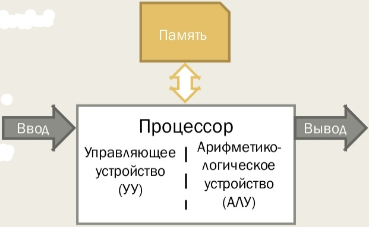
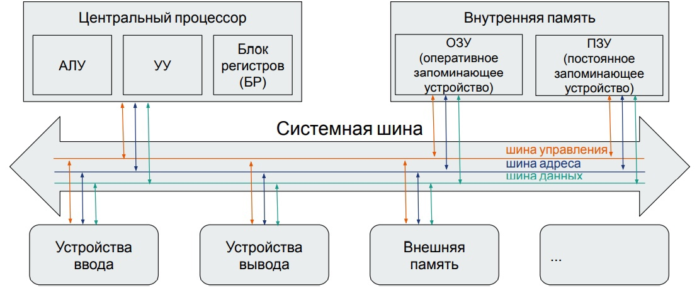
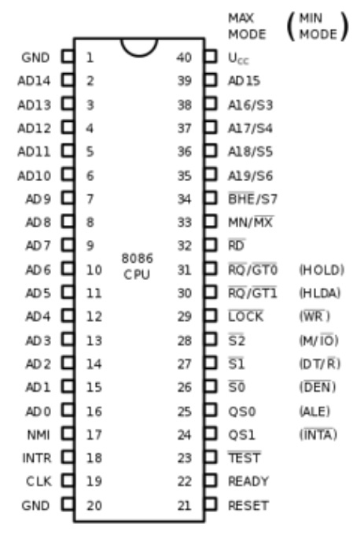
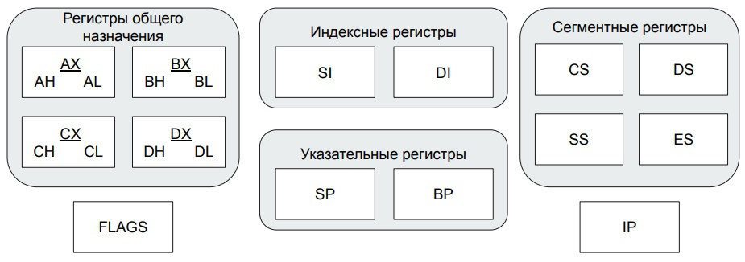
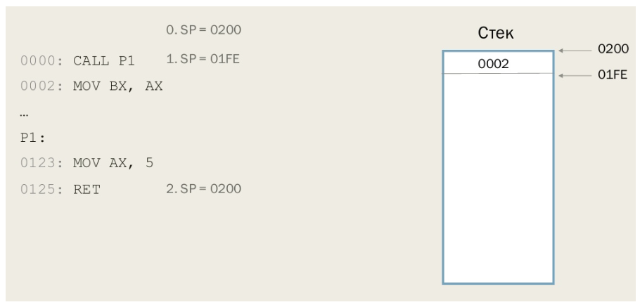
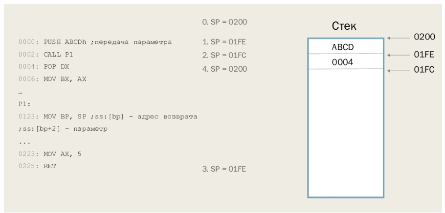
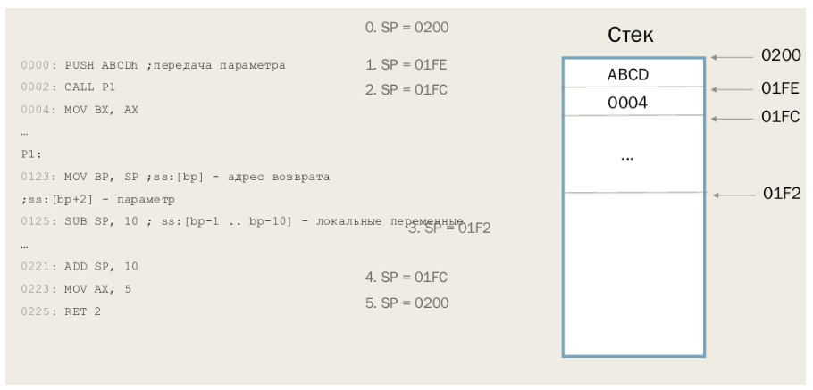
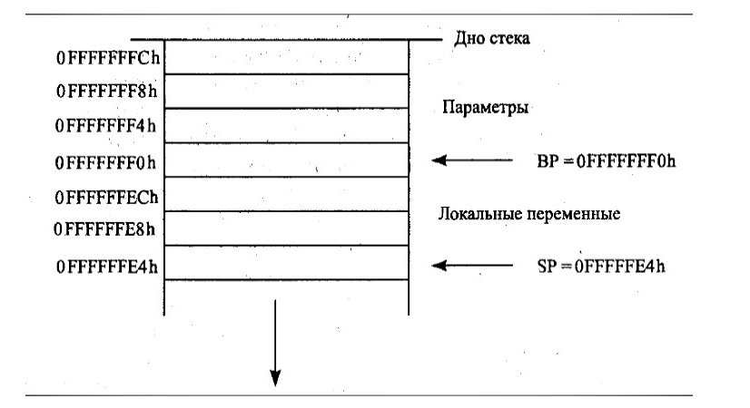

## Список вопросов:

----

1.  [Архитектура фон Неймана, принципы фон Неймана.](#архитектура-фон-неймана-принципы-фон-неймана)
2.  [Машинные команды, машинный код. Понятие языка ассемблера.](#машинные-команды-машинный-код-понятие-языка-ассемблера)
3.  [Виды памяти ЭВМ. Запуск и исполнение программы.](#виды-памяти-эвм-запуск-и-исполнение-программы)
4.  [Сегментная модель памяти в архитектуре 8086.](#сегментная-модель-памяти-в-архитектуре-8086)
5.  [Процессор 8086. Регистры общего назначения.](#процессор-8086-регистры-общего-назначения)
6.  [Процессор 8086. Сегментные регистры. Адресация в реальном режиме. Понятие сегментной части адреса и смещения.](#процессор-8086-сегментные-регистры-адресация-в-реальном-режиме-понятие-сегментной-части-адреса-и-смещения)
7.  [Процессор 8086. Регистр флагов.](#процессор-8086-регистр-флагов)
8.  [Команды пересылки данных.](#команды-пересылки-данных)
9.  [Команда сравнения.](#команда-сравнения)
10. [Команды условной и безусловной передачи управления.](#команды-условной-и-безусловной-передачи-управления)
11. [Арифметические команды.](#арифметические-команды)
12. [Двоично-десятичная арифметика.](#двоично-десятичная-арифметика)
13. [Команды побитовых операций. Логические команды.](#команды-побитовых-операций-логические-команды)
14. [Команды работы со строками.](#команды-работы-со-строками)
15. [Команда трансляции по таблице.](#команда-трансляции-по-таблице)
16. [Команда вычисления эффективного адреса.](#команда-вычисления-эффективного-адреса)
17. [Структура программы на языке ассемблера. Модули. Сегменты.](#структура-программы-на-языке-ассемблера-модули-сегменты)
18. [Виды ассемблеров. Intel-синтаксис, АТ&Т-синтаксис.](#виды-ассемблеров-intel-синтаксис-атт-синтаксис)
19. [Подпрограммы. Объявление, вызов.](#подпрограммы-объявление-вызов)
20. [Подпрограммы. Возврат управления.](#подпрограммы-возврат-управления)
21. [Макроопределения.](#макроопределения)
22. [Стек. Аппаратная поддержка вызова подпрограмм.](#стек-аппаратная-поддержка-вызова-подпрограмм)
23. [Соглашения о вызовах. Понятие, основные виды соглашений.](#соглашения-о-вызовах-понятие-основные-виды-соглашений)
24. [Прерывания. Обработка прерываний в реальном режиме работы процессора.](#прерывания-обработка-прерываний-в-реальном-режиме-работы-процессора)
25. [Процессор 80386. Режимы работы. Регистры.](#процессор-80386-режимы-работы-регистры)
26. [Страничная модель памяти. Виртуальная память.](#страничная-модель-памяти-виртуальная-память)
27. [Математический сопроцессор. Типы данных.](#математический-сопроцессор-типы-данных)
28. [Математический сопроцессор. Регистры.](#математический-сопроцессор-регистры)
29. [Математический сопроцессор. Классификация команд.](#математический-сопроцессор-классификация-команд)
30. [Расширения процессора. ММХ. Регистры, поддерживаемые типы данных.](#расширения-процессора-ммх-регистры-поддерживаемые-типы-данных)
31. [Расширения процессора. ММХ. Классификация команд.](#расширения-процессора-ммх-классификация-команд)
32. [Расширения процессора. SSE. Регистры, поддерживаемые типы данных.](#расширения-процессора-sse-регистры-поддерживаемые-типы-данных)
33. [Расширения процессора. SSE. Классификация команд.](#расширения-процессора-sse-классификация-команд)
34. [Расширения процессора. AVX. Регистры, поддерживаемые типы данных.](#расширения-процессора-avx-регистры-поддерживаемые-типы-данных)
35. [Расширения процессора. AVX. Классификация команд.](#расширения-процессора-avx-классификация-команд)
36. [Процессоры семейства х86-64. Регистры, режимы работы.](#процессоры-семейства-х86-64-регистры-режимы-работы)
37. [Расширения процессора. AES. Назначение, классификация команд.](#расширения-процессора-aes-назначение-классификация-команд)
38. [Архитектура RISC. Семейство процессоров ARM. Версии архитектуры, профили.](#архитектура-risc-семейство-процессоров-arm-версии-архитектуры-профили)
39. [Процессоры ARM. Наборы команд. Основные регистры.](#процессоры-arm-наборы-команд-основные-регистры)
40. [Процессоры ARM. Основные команды.](#процессоры-arm-основные-команды)
---
## Ответы

---
## Архитектура фон Неймана. Принципы фон Неймана

### Архитектура фон Неймана

>* Процессор состоит из блоков УУ и АЛУ
>* УУ - дискретный конечный автомат.
Структурно состоит из: дешифратора команд (операций), регистра команд, узла вычислений текущего исполнительного адреса, счётчика команд (регистр IP).
>* АЛУ - под управлением УУ производит преобразование над данными (операндами). Разрядность операнда - длина машинного слова. (Машинное слово - машинно-зависимая величина, измеряемая в битах, равная разрядности регистров/шины данных)

### Принципы фон Неймана (архитектуры фон Неймана):  
> 1. Использование двоичной системы счисления в вычислительных машинах (0 - нет сигнала, 1 - есть сигнал).
> 2. Программное управление ЭВМ.  
> 3. Память компьютера используется не только для хранения данных, но и программ.*
> 4. Ячейки памяти ЭВМ имеют адреса, которые последовательно пронумерованы (от нуля до максимального значения). Каждый адрес ячейки по сути является переменной, с которой можно работать отдельно.
> 5. Возможность условного перехода в процессе выполнения программы (необходима для реализации сложных алгоритмов, т.к. без неё нельзя было бы строить нелинейные алгоритмы с ветвлениями и т.д.).
>
>> *Практическое значение: данные и код в оперативной памяти ничем не отличаются, что позволяет функционировать компиляторам и использовать единую память и для кода, и для данных, что сильно упрощает построение программ в целом. Но это приводит к ошибкам, когда мы случайно или специально перезаписываем что-то поверх кода и программа ломается. Решение проблемы: флаг WP в регистре CR0 (лекция 5).
---
## Машинные команды, машинный код. Понятие языка ассемблера.

***Машинная команда*** - инструкция (в двоичном коде) из аппаратно определённого набора, которую способен выполнять процессор.

***Машинный код*** - система команд конкретной вычислительной машины, которая интерпретируется непосредственно процессором.

***Язык ассемблера*** - машинно-зависимый язык программирования низкого уровня, команды которого прямо соответствуют машинным командам.

---
## Виды памяти ЭВМ. Запуск и исполнение программы.

### Схема ЭВМ


### Виды памяти
**Байт** - минимальная адресуемая единица памяти (8 бит).  

**Машинное слово** - машинно-зависимая величина, измеряемая в битах, равная разрядности регистров/шины данных.

**Параграф** - 16 байт

Память делится на внешнюю и внутреннюю  
К внутренней памяти относится:
* **ОЗУ** (оперативное запоминающее устройство)
  * **DRAM (Dynamic RAM)**: Основной тип оперативной памяти, которая периодически обновляется.
  * **SRAM (Static RAM)**: Быстрая и дорогая память, обычно используется в кэшах.
* **ПЗУ** (постоянное запоминающее устройство). 
  *  **ROM (Read-Only Memory)**: Память, из которой можно только читать, используется для хранения микропрограмм и прошивок.
  * **EPROM (Erasable Programmable ROM)**: Память, которая может быть стерта и перепрограммирована с помощью ультрафиолетового света.
  * **EEPROM (Electrically Erasable Programmable ROM)**: Память, которая может быть стерта и перепрограммирована электрически.

> В ПЗУ хранится информация, которая записывается туда при изготовлении ЭВМ. Важнейшая микросхема ПЗУ - BIOS.

### Выполнение программы
> 1. Определение формата файла (.COM или .EXE, в случае 8086)
> 2. Чтение и разбор заголовка
> 3. Считывание разделов исполняемого модуля (файла) в ОЗУ по необходимым адресам.
> 4. Подготовка к запуску, если требуется. (установка регистров; настройка окружения, загрузка библиотек (см. 1 ЛР, 2 часть))
> 5. Передача управления на точку входа. 
> 6. Дальше выполняются инструкции заданные в самой программе.

---

## Cегментная модель памяти в архитектуре 8086.

Сегментная модель памяти в архитектуре 8086

1. Сегменты памяти:
   - Память делится на сегменты размером до 64 КБ.
   - Каждый сегмент начинается с адреса, кратного 16 байтам (параграфу).
   - Основные сегменты: сегмент кода, сегмент данных, сегмент стека и дополнительные сегменты.

2. Регистры сегментов:
   - CS (Code Segment): Указывает на сегмент, содержащий исполняемый код.
   - DS (Data Segment): Указывает на сегмент, содержащий данные.
   - SS (Stack Segment): Указывает на сегмент, используемый для стека.
   - ES (Extra Segment): Используется для дополнительных данных и операций с памятью.

3. Смещение (Offset):
   - Адресация в сегменте осуществляется с помощью смещения (offset), представляющего собой 16-битное значение.
   - Смещение указывает на положение внутри сегмента и может принимать значения от 0 до 65535 (0xFFFF).

4. Формирование физических адресов:
   - Физический адрес вычисляется как комбинация содержимого регистра сегмента и смещения.
   - Формула для вычисления физического адреса:
     Физический адрес = (Содержимое регистра сегмента << 4) + Смещение

```
Пример формирования физического адреса:
Допустим, CS = 0x1234 и IP (Instruction Pointer) = 0x5678.  
Вычисление физического адреса:  
   Физический адрес = (0x1234 << 4) + 0x5678  
                    = 0x12340 + 0x5678  
                    = 0x179B8
```
---

## [Процессор 8086](#процессор-8086-архитектура) архитектура

### Устройство 8086


### Архитектура 8086 с точки зрения программиста (структура блока регистров).

---


## [Процессор 8086](#процессор-8086-архитектура). Регистры общего назначения.

Регистры общего назначения: **AX, BX, CX, DX**.  
Каждый из регистров имеет старшую и младшую часть, по 1 байту на каждый.

---

## [Процессор 8086](#процессор-8086-архитектура). Сегментные регистры. [Адресация в реальном режиме. Понятие сегментной части адреса и смещения](#cегментная-модель-памяти-в-архитектуре-8086).

Архитектура 8086 имеет четыре сегментных регистра:
* CS (code segment)
* SS (stack segment) 
* DS (data segment) 
* ES (extra segment)
> Каждый сегментный регистр определяет адрес начала сегмента в памяти, при этом сегменты могут совпадать или пересекаться. По умолчанию регистр CS используется при выборке инструкций, регистр SS при выполнении операций со стеком, регистры DS и ES при обращении к данным

**Логический адрес** записывают как сегмент:смещение (и те, и те в 16 с/с). В реальном режиме для вычисления физического адреса, адрес из сегмента сдвигают влево на 4 разряда (можно сказать, что просто приписывают 0 в конце или умножают на 16) и добавляют смещение.  
`Например, логический адрес 7522:F139 дает физический адрес 84359.`  

На шину передается именно физический адрес. Если результат больше, чем 2^20 - 1, то 21 бит отбрасывают.
Такой режим работы процессора называют реальным режимом адресации процессора  
`При такой адресации адреса 0400h:0001h и 0000h:4001h будут ссылаться на одну и ту же ячейку памяти, так как 400h × 16 + 1 = 0 × 16 + 4001h.`

---

## [Процессор 8086](#процессор-8086-архитектура). Регистр флагов.

Флаги **выставляются при операциях**, но не обязательно все сразу. Например INC и DEC не затрагивают флаг CF, в отличии от ADD и SUB.

Также есть команды рассчитанные на флаги, например CMP, которая выставляет флаги такие, как если бы произошло вычитание аргументов.

**Как мы помним, регистры у нас размером в 16 бит.**

| 0  | 1  | 2  | 3  | 4  | 5  | 6  | 7  | 8  | 9  | 10  | 11  | 12   | 13   | 14 | 15 |
|----|----|----|----|----|----|----|----|----|----|-----|-----|------|------|----|----|
| CF | -  | PF | -  | AF | -  | ZF | SF | TF | IF | DF  | OF  | IOPL | IOPL | NT | -  |


■ CF (carry flag) - флаг переноса - устанавливается в 1, если результат предыдущей операции не уместился в приемник и произошел перенос или если требуется заем при вычитании. Иначе 0.

■ PF (parity flag) - флаг чётности - устанавливается в 1, если младший байт результата предыдущей операции содержит четное количество единиц.

■ AF (auxiliary carry flag) - вспомогательный флаг переноса - устанавливается в 1, если в результате предыдущей операции произошел перенос из 3 в 4 или заем из 4 в 3 биты.

■ ZF (zero flag) - флаг нуля - устанавливается в 1, если результат предыдущей команды равен 0.

■ SF (sign flag) - флаг знака - всегда равен старшему биту результата.

■ TF (trap flag) - флаг трассировки - предусмотрен для работы отладчиков в пошаговом режиме. Если поставить в 1, после каждой команды будет происходить передача управления отладчику.

■ IF (interrupt enable flag) - флаг разрешения прерываний - если 0 процессор перестает обрабатывать прерывания от внешних устройств.

■ DF (direction flag) - флаг направления - контролирует поведение команд обработки строк. Если 0, строки обрабатываются слева направо, если 1 справа налево.

■ OF (overflowflag) - флаг переполнения - устанавливается в 1, если результат предыдущей операции над числами со знаком выходит за допустимые для них пределы.

■ IOPL (I/O privilege level) - уровень приоритета ввода-вывода - а это на 286, на не нужно пока.

■ NT (nested task) - флаг вложенности задач - а это на 286, на не нужно пока.

---

## Команды пересылки данных.

### MOV <приемник>, <источник>.  
* Приемник: POH (регистр общего назначения), сегментный регистр, переменная (то есть ячейка памяти)  
* Источник: непосредственный операнд (например, число), POH, сегментный регистр, переменная

**Нельзя загрузить в сегментный регистр значение непосредственно из памяти**. Поэтому для этого используют промежуточный регистр (в начале лабы всегда так делали).

**Переменные не могут быть одновременно и источником, и приемником.**

``` 
Пример:

Правильно:
MOV AX, 5
MOV BX, DX
MOV [1234h], CH
MOV DS, AX

Неправильно:
MOV [0123h], [2345h] ; нельзя напрямую скопировать переменную в переменную, 
; т.к. процессор может либо что-то считать из памяти (в регистры), либо записать в неё (из регистров)
MOV DS, 1000h        ; в сегментные регистры нельзя напрямую записывать константы,
; т.е. в сегментные регистры можно записывать значения только из регистров общего назначения

```

### XCHG <операнд1>, <операнд2>

Обмен операндов между собой. Выполнятеся либо над двумя регистрами, либо регистр + переменная.


---

## Команда сравнения.

### CMP <приемник>, <источник>
**Источник** - число, регистр или переменная.  
**Приемник** - регистр или переменная; не может быть переменной одновременно с источником.

Вычитает источник из приёмника, результат никуда не сохраняется, выставляются флаги **CF, PF, AF, ZF, SF, OF**.

### TEST <приемник>, <источник>
Аналог **AND**, но результат не сохраняется. Выставляются флаги **SF, ZF, PF**.

Можно использовать для проверки на ноль, например ```TEST bx, bx```

---

## Команды условной и безусловной передачи управления.

**Условный переход** - переход, происходящий при выполнении какого-то условия.

**Безусловный переход** - переход, не зависящий от чего-либо (совершаемый в любом случае).

### Виды безусловных переходов

**JMP** - оператор безусловного перехода.   

| Вид перехода      | Дистанция перехода                           |
|-------------------|----------------------------------------------|
| short (короткий)  | -128..+127 байт                              |
| near (ближний)    | в том же сегменте (без изменения CS)         |
| far (дальний)     | в другой сегмент (со сменой CS)              |


Для короткого и ближнего переходов непосредственный операнд (число) прибавляется к **IP**. Регистры и переменные заменяют старое значение в **IP (CS:IP)**.

### Команда безусловной передачи управления JMP

JMP <операнд>

- Передаёт управление в другую точку программы, не сохраняя какой-либо информации для возврата.
- Операнд - непосредственный адрес, регистр или переменная.

### Команды условных переходов J.. (Зубков, Assembler, …, глава 2)
- Переход типа short или near
- Обычно используются в паре с CMP
- "Выше" и "ниже" - при сравнении беззнаковых чисел
- "Больше" и "меньше" - при сравнении чисел со знаком

|Команда|Описание|Состояние флагов для выполнения перехода|
|---|---|---|
|JO   |Есть переполнение   |OF = 1   |
|JNO   |Нет переполнения   |OF = 0   |
|JS   |Есть знак   |SF = 1   |
|JNS   |Нет знака    |SF = 0   |
|JE/JZ   |Если равно/если ноль   |ZF = 1   |
|JNE/JNZ   |Не равно/не ноль   |ZF = 0   |
|JP/JPE   |Есть чётность/чётное   |PF = 1   |
|JNP/JPO   |Нет чётности/нечётное   |PF = 0   |
|JCXZ   |CX = 0   |   |

|Команда|Описание|Состояние флагов для выполнения перехода|Знаковый|
|---|---|---|---|
|JB | Если ниже|CF = 1   |Нет |
|JNAE   |Если не выше и не равно  |CF = 1   |Нет |
|JC   |Если перенос  |CF = 1   |Нет |
|JNB   |Если не ниже   |CF = 0   |Нет   |
|JAE   |Если выше или равно   |CF = 0   |Нет   |
|JNC   |Если нет переноса   |CF = 0   |Нет   |
|JBE   |Есть ниже или равно   |CF = 1 или ZF = 1   |Нет   |
|JNA   |Если не выше   |CF = 1 или ZF = 1   |Нет   |
|JA   |Если выше   |CF = 0 и ZF = 0   |Нет   |
|JNBE   |Если не ниже и не равно   |CF = 0 и ZF = 0   |Нет   |
|JL   |Если меньше   |SF <> OF   |Да   |
|JNGE   |Если не больше и не равно   |SF <> OF   |Да   |
|JGE   |Если больше или равно   |SF = OF   |Да   |
|JNL   |Если не меньше   |SF = OF   |Да   |
|JLE   |Если меньше или равно   |ZF = 1 или SF <> OF    |Да   |
|JNG   |Если не больше   |ZF = 1 или SF <> OF    |Да   |
|JG   |Если больше   |ZF = 0 и SF = OF   |Да   |
|JNLE   |Если не меньше и не равно   |ZF = 0 и SF = OF   |Да   |


```assembly
Пример

    ...
    XOR AX, AX
    MOV BX, 5
label1:
    INC AX
    ADD BX, AX
    JMP label 1
```

---

## Арифметические команды.

### Целочисленная арифметика (основные команды).
- `ADD <приёмник>, <источник>` - выполняет арифметическое сложение приёмника и источника. Сумма помещается в приёмник, источник не изменяется.
- `SUB <приёмник>, <источник>` - арифметическое вычитание источника из приёмника.
- `MUL <источник>` - беззнаковое умножение. Умножаются источник и `AL/AX`, в зависимости от размера (разрядности) источника (если 1 байт, то `AL`, а если 2 байта, то на `AX`). Результат помещается в `AX` (если 1 байт умножался на 1 байт; то есть предполагается, что результат может быть в 2 раза длиннее аргумента) либо `DX:AX` (если 2 байта умножались на 2 байта; предполагается, что результат получится 4-байтовым, и его старшие 2 байта помещаются в `DX`, младшие 2 - в `AX`).
- `DIV <источник>` - целочисленное беззнаковое деление. Делится `AL/AX` на источник. Результат помещается в `AL/AX`, остаток - в `AH/DX`. Выбор регистра опять зависит от разрядности источника (закономерность аналогична умножению).
- `INC <приёмник>` - инкремент на 1.
- `DEC <приёмник>` - декремент на 1.


---

## Двоично-десятичная арифметика.

**Что такое двоично-десятичные числа?**

``` 
Задействуются не все возможные двоичные коды. Если число не упакованное, то из 
256 возможных значений для байта будет использоваться только 10, то есть 
число – это байт от 00h до 09h. Если упакованное, то 
будет байт от 00h до 99h (цифры A..F не задействуются).
```

**НЕУПАКОВАННОЕ ДД число** - десятичная цифра, хранящаяся в байте.

**УПАКОВАННОЕ ДД число** - две десятичные цифры, хранящиеся в полубайтах одного байта.

Если такие числа пытаться складывать или как-то там изменять, то возникают проблемы `19h + 1 = 1Ah => 20h`

Поэтому есть команды для коррекции:
* **DAA**, **DAS** - команды для коррекции упакованных дд чисел после сложения/вычитания
* **AAA**, **AAS** - команды для коррекции неупакованных дд чисел после сложения/вычитания
* **AAM**, **AAD** - коррекция для неупакованных дд чисел после умножения/деления.


**Пример 1. Неупакованные числа**
``` assembly
mov AL, 6   ; AL = 6
add AL, 7   ; AL = 6 + 7 = 13 (получили не BCD число)
aaa         ; проводим коррекцию -> получаем al = 3, CF = 1 (флаг переполнения)
```
**Как это работает?**
* команда `ааа` анализирует значение младшей тетрады регистра AL
* если значение регистра было бы меньше 9, то флаг СF был бы сброшен в 0 и был бы переход к следующей команде
* если значение больше 9
    * к содержимому младщей тетрады AL + 6 -> корректируем результат в нужную сторону
    * флаг CF устанавливается в 1 (фиксируется перенос в старший разряд, чтобы его можно было учесть в последующих действиях)

```
  0000 0110   (6) 
 +            
  0000 0111   (7)
  ---------
  0000 1101   (13)

Нужна коррекция:
  1101 + 0110 = 0011 (3) -- откорректировали младшую тетраду
  CF = 1
```


**Пример 2. Упакованные числа**
```assembly
mov AL,71H   ; AL = 0x71h
add AL,44H   ; AL = 0x71h + 0x44h = 0xB5h
daa          ; AL = 0x15h
             ; CF = 1 - перенос является частью результата 71 + 44 = 115
```


---

## Команды побитовых операций. Логические команды.

### Побитовая арифметика (основные команды).
- `AND <приёмник>, <источник>` - побитовое “И”. 
  ```asm
  AND al, 00001111b
  ```
- `OR <приёмник>, <источник>` - побитовое “ИЛИ”. 
  ```asm
  OR al, 00001111b
  ```
- `XOR <приёмник>, <источник>` - побитовое исключающее “ИЛИ”. 
  ```asm
  XOR AX, BX
  XOR AX, AX - быстрое зануление
  ```
- `NOT <приёмник>` - инверсия
  ```asm
  NOT AX
  ```
- `TEST <приемник> <источник>` - аналог AND, но результат не сохраняется
    ```assembly
    TEST AX, 1 ; Выставляются SF (sign < 0), ZF (zero), PF (parity).
    ; сбрасывает флаги OF и CF  
    ; приемник - обл памяти или регистр назначения
  ```

### Побитовые сдвиги
- ``` assembly
    SAR <приёмник>, <счётчик>  ; арифметический сдвиг вправо (с сохранением знакового бита)
    ```
 
- ``` assembly
    SHR <приёмник>, <счётчик>           ; логический сдвиг вправо (старший бит зануляем)
    ```
    
-   ``` assembly
    SHL <приёмник>, <счётчик>           ; сдвиг влево (SAL - эквивалентная команда)
    ```
    
-   ``` assembly
    ROR <приёмник>, <счётчик>           ; циклический сдвиг вправо
    ```
    
-   ``` assembly
    ROL <приёмник>, <счётчик>           ; циклический сдвиг влево
    ```
    
-   ```assembly
    RCR <приёмник>, <счётчик>           ; циклический сдвиг вправо, через флаг переноса
    ```
    
-   ```assembly
    RCL <приёмник>, <счётчик>           ; циклический сдвиг влево, через флаг переноса 
    ```

*О циклическом сдвиге с флагом* - задействуется не 16 бит, а 17, младший бит попадет в CF, а CF попадет в старший бит при сдвиге вправо

Все команды изменяют регистр флагов FLAGS


> ### ДОП
>
>*Нужно понимать, что на лекциях Кузнецов также давал следующие команды для работы с битами/байтами*
>
>**BT**, **BTR**, **BTS**, **BTC**, **BSF**, **BSR**, **SETcc**
>
>? Что такое байт?  
> Минимальная адресуемая единица памяти
>
>? Что такое битовая строка?
> Последовательность битов, которая интерпретируется как независимые биты, 
> а не как какие-то данные. 
> Пример – регистр флагов.
>```
>
>Работать с битами напрямую нельзя, поэтому у нас есть чудо команды.
>
>```assembly
>BT <база>, <смещение>          ; считать в CF значение бита из битовой строки
>```
>
>```assembly
>BTS <база>, <смещение>         ; установить бит в 1
>```
>
>```assembly
>BTR <база>, <смещение>         ; сбросить бит в 0
>```
>
>```assembly
>BTC <база>, <смещение>         ; инвертировать бит
>```
>
>```assembly
>BSF <приемник>, <источник>     ; прямой поиск бита (от младшего разряда)
>```
>
>```assembly
>BSR <приемник>, <источник>     ; обратный поиск бита (от старшего разряда)
>```
>
>```assembly
>SETcc <приемник>    ; выставляет приемник (1 байт) в 1 или 0 
>                    ; в зависимости от условия, аналогично Jcc.
>```

---

## Команды работы со строками.

### Исторически есть два способа хранения строк
1. Сишный – нулевой байт в конце
2. Паскалевский – в первых двух байтах (или одном) хранится длина, а дальше идет непосредственно набор символов.

Разница в том, что во втором случае длину мы знаем заранее и нам не нужно пробегать всю строку, чтобы ее узнать, но при этом длина ограничена. Отдельный плюс паскалевского представления – нулевой байт может быть частью строки.


### Как работают команды работы со строками в ассемблере
> Это довольно составные команды. Они читают с адреса источника байт (или два байта, или может быть четыре байта), увеличивают индексы SI или DI на единицу (или на два, или на 4). Далее, если команды связаны с записью, то они будут записывать прочитанные байты в приемник.

❗️ Несмотря на указание <п> и <и> в командах, на самом деле в коде они прописываться не будут

Строка источник - **DS:SI**, строка-приемник - **ES:DI**

```assembly
MOVS / MOVSB / MOVSW <п> <и>             ; копирование
```

```assembly
CMPS / CMPSB / CMPSW <п> <и>             ; сравнение
```

```assembly
SCAS / SCASB / SCASW <и>                 ; сканирование (сравнение с AL / AX)
```

```assembly
LODS / LODSB / LODSW <и>                 ; чтение (в AL / AX)
```

```assembly
STOS / STOSB / STOSW <п>                 ; запись (из AL / AX)
```

За один раз обрабатывается один байт (слово).

После выполнения SI и DI увеличиваются на 1 (или 2 если W), если флаг DF = 0, или уменьшаются на 1 (или 2 если W), если DF = 1.

### Объединение с циклами

Если мы хотим работать со строками, а не с одним символом, то используются префиксы (пишутся в одну строчку через пробел с командой):

```assembly
REP               ; повторить следующую строковую операцию
REPE              ; повторить следующую строковую операцию, если равно
REPZ              ; повторить следующую строковую операцию, если нуль
REPNE             ; повторить следующую строковую операцию, если не равно
REPNZ             ; повторить следующую строковую операцию, если не нуль

```

При добавлении подобного префикса получится “цикл”, который будет выполняться столько раз, сколько выставлен CX (как в loop).
Команды с Z кроме CX будут еще контролировать состояние флага ZF.


---

## Команда трансляции по таблице.

```assembly
XLAT [адрес]
```

Эта команда помещает в **AL** байт из таблицы по адресу **DS:BX** со смещением относительно начала таблицы, равным **AL**. 

*Таблица - массив, который не превышает 256 ключей памяти*

**Особенности**
 * Адрес, указанный в исходном коде, не обрабатывается компилятором и служит в качестве комментария. 
 * Если в адресе явно указан сегментный регистр, он будет использован вместо DS (то есть смещение всегда берется из BX, а сегментная часть из указанного регистра)

```assembly
XLATB   ->    AL = DS:[(E)BX + AL]
```

**Для чего нужна?**

Такая команда может использоваться, например, для транслитерации или для перевода 16-ричных чисел в символы (где мы значения от 0 до 9 будем конвертировать в цифры, а значения от 10 до 15 будем конвертировать в буквы от A до F).    

Фактически, операция нужна для конвертации по словарю (причем “не линейно, а по массиву”). Мы объявляем целевой массив в памяти, настраиваем на него адреса DS:BX и в AL кладем номер, который хотим из этого массива получить. После этого этот номер подменяется значением из этого массива.

**Пример**
```assembly
table	db 100h dup(?)
...
mov	bx, offset table
mov	al, 1Fh
xlat
```

---

## Команда вычисления эффективного адреса.

**Эффективный адрес** - адрес, по которому с точки зрения программиста происходит обращение к памяти.

```assembly
LEA <приемник>, <источник> 
```

Вычисляет эффективный адрес источника и помещает его в приемник. Под адресом здесь тоже нужно понимать смещение. 

**Используется для**
* Вычисления адресов на лету (позволяет вычислять адреса, описанные сложными методами адресации)
* Быстрых вычислений
  ```assembly
  lea bx, [bx + bx * 4]
  lea bx, [ax + 12]
  ```

  Такие вычисления занимают меньше памяти, чем соответствующие MOV и ADD, не изменяют флаги (поддерживается сложение с константой и сложение/умножение какого-то регистра)

---

## Структура программы на языке ассемблера. Модули. Сегменты.

>Основное, из чего состоит программа – это файлы с исходным кодом. Такие файлы в ассемблере называются **модулями**.
>
>Основное, что находится в каждом модуле – это **описание сегментов** (то есть описание блоков памяти). 
>
>Внутри сегментов находятся:
> * Команды процессора
> * Инструкции описания структур данных, выделения памяти для переменных и констант
> * Макроопределения

### Структура программы на ассемблере.
###### (Зубков С. В. Assembler для DOS, Windows, Unix, глава 3)
- Модули (файлы исходного кода)
  - Сегменты (описание блоков памяти)
    - команды процессора;
    - инструкции описания структур данных, выделения памяти для переменных и констант;
    - макроопределения.
#### Полный формат строки:
`метка   команда/директива   операнды   ;   комментарий`

### Метки.
- В коде:
    #### Метка в коде заканчивается двоеточием и обозначает ссылку на команду, расположенную за ней.
    ```asm
        mov cx, 5
    label1:
        add ax, bx
        loop label1
    ```
    (5 раз прибавляем bx к ax)
    #### Метки обычно используются в командах передачи управления.
- В данных:
  #### Метка в описании данных является ссылкой на переменную, расположенную после неё. Метка не является директивой выделения памяти.
  - label
    - `метка label тип`
    - Возможные типы:
      - BYTE (1 байт)
      - WORD (2 байта)
      - DWORD (4 байта)
      - FWORD (6 байт)
      - QWORD (8 байт)
      - TBYTE (10 байт)
      - NEAR - тип для хранения меток в коде или адресов команд для меток ближнего перехода
      - FAR - тип для хранения меток в коде или адресов команд для меток дальнего перехода

  - EQU, =
    - `label EQU выражение` (Пример выражения: 5 + 2, **вычисляется на этапе компиляции**)
    - Макрос
    - Вычисляет выражение в правой части и приравнивает его метке

---

## Виды ассемблеров. Intel-синтаксис, АТ&Т-синтаксис.

### Виды ассемблеров

Ассемблеры классифицируются по разным критериям, включая синтаксис, целевую архитектуру и функциональные возможности. Два основных вида синтаксиса ассемблерных языков для архитектуры x86 — это синтаксис Intel и синтаксис AT&T.

### Intel-синтаксис

Синтаксис **Intel** был разработан самой компанией Intel и является наиболее распространённым среди ассемблеров для процессоров семейства x86.

#### Примеры синтаксиса Intel

```assembly
section .data
    num1 db 5
    num2 db 10
    result db 0

section .text
    global _start

_start:
    mov al, [num1]   ; Загрузить значение num1 в регистр AL
    add al, [num2]   ; Сложить значение num2 с AL
    mov [result], al ; Сохранить результат в result

    ; Завершить выполнение программы
    mov eax, 60      ; syscall: exit
    xor edi, edi     ; статус выхода 0
    syscall
```

### AT&T-синтаксис

Синтаксис **AT&T** используется в ассемблере GAS (GNU Assembler) и отличается от синтаксиса Intel порядком операндов и обозначением регистров.

Примеры синтаксиса AT&T

```
.section .data
num1: .byte 5
num2: .byte 10
result: .byte 0

.section .text
.global _start

_start:
    movb num1, %al   ; Загрузить значение num1 в регистр AL
    addb num2, %al   ; Сложить значение num2 с AL
    movb %al, result ; Сохранить результат в result

    ; Завершить выполнение программы
    mov $60, %eax    ; syscall: exit
    xor %edi, %edi   ; статус выхода 0
    syscall
```

### Основные различия между Intel и AT&T синтаксисами

1. **Порядок операндов**:
    * Intel: операция dest, src
    * AT&T: операция src, dest


2. **Обозначение регистров**:

    * Intel: регистры без префиксов (например, eax)
    * AT&T: регистры с префиксом % (например, %eax)


3. **Немедленные значения**:
   * Intel: значения без префиксов (например, 10)
   * AT&T: значения с префиксом $ (например, $10)


4. **Доступ к памяти**:
   * Intel: квадратные скобки для адресации памяти (например, [num1])
   * AT&T: круглые скобки для адресации памяти (например, num1)


5. **Операции с размерами**:
   * Intel: операции определяются по регистрам и контексту (например, mov)
   * AT&T: операции имеют суффиксы для указания размера (например, movb для байтовой операции)

---

## Подпрограммы. Объявление, вызов.

> **Подпрограмма** – именованная часть программы, содержащая описание определенного набора действий. Подпрограмма может быть многократно вызвана из разных частей программы.

> **Функция** - подпрограмма, которая возвращает значение явно

> **Процедура** - подпрограмма, которая не возвращает значение явно.

> **Явный возврат значения** - применение к значению оператора явного возврата.

### Объявление
```assembly
ИмяПроцедуры PROC язык расстояние
   тело процедуры
ИмяПроцедуры ENDP
```

### Вызов
```assembly
CALL <операнд>            ; вызов процедуры
```

Сохраняет адрес следующей команды в стеке (уменьшает SP [в случае ближнего перехода на 2 байта, в случае дальнего на 4] и записывает по его адресу IP либо CS:IP, в зависимости от размера аргумента)

Передает управление на значение аргумента.

**Примеры**




## [О стеке тут](#Стек-Аппаратная-поддержка-вызова-подпрограмм)

---

## Подпрограммы. Возврат управления.

> **Подпрограмма** – именованная часть программы, содержащая описание определенного набора действий. Подпрограмма может быть многократно вызвана из разных частей программы.

> **Функция** - подпрограмма, которая возвращает значение явно

> **Процедура** - подпрограмма, которая не возвращает значение явно.

> **Явный возврат значения** - применение к значению оператора явного возврата.

### Возврат
```assembly
RET / RETN / RETF <число>          ; возврат из процедуры
```

Загружает из стека адрес возврата, увеличивает SP

`retn` – ближний возврат (2 байта), `retf` – дальний возврат (4 байта)

Если указан операнд, его значение будет дополнительно прибавлено к SP для очистки стека от параметров

**Примеры** есть в предыдущем вопросе

## 
[О стеке тут](#Стек-Аппаратная-поддержка-вызова-подпрограмм)


---

## Макроопределения.

### Макросы. Общие сведения

**Макроопределение (макрос)** - именованный участок программы, который ассемблируется каждый раз, когда его имя встречается в тексте программы.

### Определения:
1. **Макроопределение** - специальным образом оформленная последовательность предложений языка ассемблера, под управлением которой ассемблер (точнее, его часть, называемая макрогенератором или препроцессором) порождает макрорасширения макрокоманд.
2. **Макрорасширение** - последовательность предложений языка ассемблера (обыкновенных директив и команд), порождаемая макрогенератором при обработке макрокоманды под управлением макроопределения и вставляемая в исходный текст программы вместо макрокоманды.
3. **Макрокоманда (или макровызов)** - предложение в исходном тексте программы, которое воспринимается макрогенератором как команда (приказ), предписывающая построить макрорасширение и вставить его на ее место.

* В макрокоманде могут присутствовать параметры, если они были описаны в макроопределении.
* Макроопределение без параметров однозначно определяет текст макрорасширения.
* Макроопределение с параметрами описывает множество (возможно, очень большое) возможных макрорасширений, а параметры, указанные в макрокоманде, сужают это множество до одного единственного макрорасширения.

### Определение макроса в программе
```assembly
имя MACRO параметры
...
ENDM
```
```assembly
load_reg MACRO register1, register2
  push register1
  pop register2
ENDM
```

### Сравнение макросов с подпрограммами
**Плюсы**
* Так как текст макрорасширения вставляется на место макрокоманды, то нет затрат времени, как для подпрограмм, на подготовку параметров, передачу управления и выполнение других работ при выполнении программы

**Минусы**
* При многочисленных вызовах МО (макроопределения) разрастается объем модуля программы,
* Фактические значения параметров макрокоманд должны быть известны препроцессору или могли быть вычислены им (нельзя использовать в качестве * фактического параметра МО значения переменных или регистров, так как они могут быть известны только при выполнении программы).


### Замечания
* Имена формальных параметров МО-й локализованы в них, т.е. вне определения могут использоваться для обозначения других объектов.
* Число формальных параметров ограничено лишь длиной строки, обрабатываемой ассемблером.
* МО-я должны предшествовать обращениям к ним.
* Нет ограничений, кроме физических, на число предложений в теле МО.
* В листинге предложениям макрорасширений предшествуют ЦБЗ, указывающие глубину их вложения в макроопределениях.


### Макроопределения
### Директива присваивания =
Директива присваивания служит для создания целочисленной макропеременной или изменения её значения и имеет формат
```assembly
Макроимя = Макровыражение
```

Макровыражение (или Константное выражение) - выражение, вычисляемое препроцессором, которое может включать целочисленные константы, макроимена, вызовы макрофункций, знаки операций и круглые скобки, результатом вычисления которого является целое число

Операции:
* арифметические (+, -, *, /. MOD)
* логические
* сдвигов
* отношения

### Директивы отождествления EQU, TEXTEQU
Директива для представления текста и чисел:

`Макроимя EQU нечисловой текст и не макроимя ЛИБО число`

`Макроимя EQU <Операнд>`

`Макроимя TEXTEQU Операнд`

```assembly
X EQU [EBP+8]
MOV ESI, X
```

### Диррективы условного ассемблирования
```assembly
IF:
IF c1
…
ELSEIF c2
…
ELSE
…
ENDIF
```
```assembly
IFB <par>              ; истинно, если параметр не определён 
                       ; (то есть фактический параметр par не был задан в МКоманде)
IFNB <par>             ; истинно, если параметр определён
IFIDN <s1>,<s2>        ; истинно, если строки совпадают
IFDIF <s1>,<s2>        ; истинно, если строки разные
IFDEF/IFNDEF <name>    ; истинно, если имя объявлено/не объявлено
```

### Блоки повторения
```assembly
REPT <число> 
...                 ; Повтор фиксированное число раз
ENDM
```

```assembly
; Подстановка фактических параметров по списку на место формального
IRP form,<fact_1[,fact_2,...]>  (или FOR)
...                 
ENDM
```

```assembly
; Подстановка символов строки на место формального параметра
IRPC form,fact                  (или FORC)
...
ENDM
```

```assembly
WHILE cond 
...                 ; Классический while
ENDM
```


**Пример**
```assembly
; Определение переменных A0, A1, A2, A3 с начальными значениями 0,1,2,3 соответственно

IRP X,<0,1,2,3> ;;параметры - числа
    A&X DB X
ENDM
```


---

## Стек. Аппаратная поддержка вызова подпрограмм.

### Введение


**SP** – Stack Pointer (меняется автоматически процессором, но руками его тоже можно поменять)

**BP** – Base Pointer (вспомогательный регистр, используется программистом или компилятором)

### Стек
**Стек** – структура данных, которая работает по принципу первым пришел, последним ушел (LIFO / FILO).

**Сегмент стека** – область памяти программы, используемая ее подпрограммами, а также (вынужденно) обработчиками прерываний.

SP – указатель на вершину стека

❗️ В х86 стек растет вниз, в сторону уменьшения адресов. При запуске программы SP указывает на конец сегмента.

```
❔ Почему так сделали
  Чтобы проще было отследить переполнение стека 
  (если адрес дошел до 0, значит мы заполнили все) => 
  экономия регистра (не используем доп регистр для хранения размера стека).
```

### Команды непосредственной работы со стеком

```assembly
PUSH <и>     ; поместить данные в стек. 
             ; Уменьшает SP на размер источника и записывает значение по адресу SS:SP
```
```assembly
POP <п>      ; считать данные из стека.  
             ; Считывает значения адреса SS:SP и увеличивает SP на величину приемника.
```
```assembly
PUSHA        ; поместить в стек регистры AX, CX, DX, BX, SP, BP, SI, DI.
```

```assembly
POPA         ; загрузить регистры из стека (SP игнорируется)
```

```assembly
PUSHF        ; поместить в стек содержимое регистра флагов
```

```assembly
POPF         ; загрузить регистр флагов из стека.
```

### Base Pointer
Используется для:
* сохранения “начального” значения SP
  > типа чтобы в подпрограмме можно было писать что-то в стек, а по возвращении можно было вернуть состояние стека
* адресации параметров
  > то, что положила в стек вызывающая программа
* адресации локальных переменных
  > глобальные переменные обычно валяются в сегменте данных, локальные же там хранить нельзя, так как в этом случае при каждом вызове они будут перезатираться

*При вызове подпрограммы параметры кладут на стек, а в BP кладут текущее значение SP. Если программа использует стек для хранения локальных переменных, SP изменится и таким образом можно будет считывать переменные напрямую из стека (их смещения запишутся как BP + номер параметра)*



## Соглашения о вызовах. Понятие, основные виды соглашений.

Соглашения о вызовах (calling conventions) — это набор правил, которые определяют, как функции вызываются на уровне машинного кода. Эти правила включают порядок передачи аргументов, использование регистров, управление стеком и возврат значений. Различные соглашения о вызовах могут быть использованы для разных языков программирования, компиляторов и архитектур процессоров.

### Основные аспекты соглашений о вызовах

1. **Порядок передачи аргументов**: Определяет, в каком порядке передаются аргументы функции (слева направо или справа налево).
2. **Способ передачи аргументов**: Указывает, где хранятся аргументы — в регистрах или на стеке.
3. **Управление стеком**: Определяет, кто отвечает за очистку стека после вызова функции — вызывающая или вызываемая функция.
4. **Использование регистров**: Указывает, какие регистры должны сохраняться и восстанавливаться (callee-saved) и какие могут быть изменены (caller-saved).

### Основные виды соглашений о вызовах

1. **CDECL (C Declaration)**
   - **Порядок передачи аргументов**: Справа налево.
   - **Способ передачи аргументов**: Аргументы передаются через стек.
   - **Управление стеком**: Стек очищается вызывающей функцией.
   - **Использование регистров**: Caller-saved. Вызывающая функция сохраняет регистры, которые она использует.

2. **STDCALL (Standard Call)**
   - **Порядок передачи аргументов**: Справа налево.
   - **Способ передачи аргументов**: Аргументы передаются через стек.
   - **Управление стеком**: Стек очищается вызываемой функцией.
   - **Использование регистров**: Caller-saved. Вызывающая функция сохраняет регистры, которые она использует.

3. **FASTCALL**
   - **Порядок передачи аргументов**: Различается в зависимости от реализации.
   - **Способ передачи аргументов**: Первые несколько аргументов передаются через регистры, остальные через стек.
   - **Управление стеком**: Зависит от реализации, но обычно стек очищается вызываемой функцией.
   - **Использование регистров**: Caller-saved для регистров, используемых для передачи аргументов.

4. **THISCALL**
   - **Используется в C++ для вызова методов классов.**
   - **Порядок передачи аргументов**: Справа налево.
   - **Способ передачи аргументов**: Первый аргумент (указатель на объект, `this`) передается через регистр, остальные через стек.
   - **Управление стеком**: Стек очищается вызываемой функцией.
   - **Использование регистров**: Caller-saved.

5. **MSCALL**
   - **Используется в Microsoft Windows API.**
   - **Порядок передачи аргументов**: Справа налево.
   - **Способ передачи аргументов**: Аргументы передаются через стек.
   - **Управление стеком**: Стек очищается вызываемой функцией.
   - **Использование регистров**: Caller-saved.

### ДОП

**Соглашения о вызовах** – как передавать параметры (стек или регистры), как возвращать результат (по си возврат идет через ax), способы освобождения памяти от параметров.

**Стековый кадр** – механизм передачи аргументов и выделения временной памяти с использованием аппаратного стека. Содержит информацию о состоянии подпрограммы.

**Включает в себя**
* параметры
* адрес возврата (обязательно)
* локальные переменные


---

## Прерывания. Обработка прерываний в реальном режиме работы процессора.

**Прерывание** - особая ситуация, когда выполнение текущей программы приостанавливается и управление передается программе-обработчику возникшего прерывания.

**Виды прерываний**
* аппаратные (асинхронные) - события от внешних устройств;
* внутренние (синхронные) - события в самом процесооре, например, деление на ноль;
* программные - вызванные командой int.

### Таблица векторов прерываний

**Вектор прерывания** - номер, который идентифицирует соответствующий обработчик прерываний. 

Векторы прерываний объединяются в **таблицу векторов прерываний**, содержащую адреса обработчиков прерываний. 
* Располагается в самом начале памяти, начиная с адреса 0. 
* Доступно 256 прерываний. 
* Каждый вектор занимает 4 байта - полный адрес. 
* Размер всей таблицы - 1 Кб.

### Срабатывание прерывания
* Сохранение в текущий стек регистра флагов и адреса возврата (адреса следующей команды)
* Передача управления по адресу обработчика из таблицы векторов
* Настройка стека 
  > возможно, обработчику прерываний нужен свой стек, потому что стек остается связан с той программой, которая работала до срабатывания прерывания; если обработчик сложный, то иногда такие обработчики перенастраивают стек
* Повторная входимость (реентерабельность), необходимость запрета прерываний 
  > Кузнецов: "таймер тикает, срабатывают прерывания. В какой-то момент прерывание тика таймера не успевает отработать до след тика, вызывается еще раз тоже прерывание и нужно обеспечить корректную работу в такой ситуации"; запрет прерывания можно делать только на короткий срок, иначе можно потерять данные (переполнение буфера клавиатуры, например)

### Возврат из обработчика прерываний
**IRET** - используется для выхода из обработчика прерывания. 
* Восстанавливает FLAGS, CS:IP. 
* При необходимости выставить значение флага обработчик меняет его значение непосредственно в стеке.

### Маскировка прерываний
Внешние прерывания, в зависимости от возможности запрета, делятся на:
* **маскируемые** - прерывания, которые можно запрещать установкой соответствующего флага
* **немаскируемые** - обрабатываются всегда, независимо от запретов  на другие прерывания

### Перехват прерывания
* Сохранение старого адреса обработчика
* Изменение вектора на "свой" адрес
* Вызов старого обработчика до/после обработки своего кода
* При деактивации - восстановление адреса старого обработчика

### Установка обработчика прерывания в DOS
```assembly
int 21h
```
* `AH = 35h`, `AL = номер прерывания` - вернет в ES:BX адрес обработчика
* `AH = 25h`, `AL = номер прерывания` - вернет в DS:DX адрес обработчика

**Пример 1.** ~По заявкам телезрителей~ как мы устанавливали собственное прерывание в [лр7](https://github.com/Tulenenok/_Machine-dependent_languages/blob/main/lab_07/main.asm)
```assembly
INSTALL_BREAKING:
    ; Скачали процедуру, которая обрабатывает прерывание 1C сейчас
    MOV AX, 351CH 
    INT 21H

    ; Если установка уже была, то нужно наоборот вернуть все как было
    CMP ES:WAS_INSTALL, 1
    JE UNINSTALL_BREAKING

    ; Сохраняем адрес вектора прерывания старого
    ; 'word ptr' нужно для того, чтобы обратиться по двухбайтному адресу
    MOV WORD PTR OLD_INTERR, BX      
    MOV WORD PTR OLD_INTERR + 2, ES  

    ; Установка нашего собственного прерывания
    MOV AX, 251CH               
    LEA DX, MY_NEW_INTERR
    INT 21H                     

    ; Прерывание 27h – завершиться, но остаться в памяти. При этом в DX кладется адрес первого байта за резидентным участком программы
    ; То есть всё, начиная с адреса метки init, будет освобождено из памяти
    LEA DX, INSTALL_BREAKING
    INT 27H 
```

### Некоторые прерывания
* `0` - деление на 0
* `1` - прерывание отладчика, вызывается после каждоый команды при флаге TF
* `3` - отладочное (`int 3` занимает 1 байт)
* `4` - переполнение при команде INTO (команда контроля переполнения)
* `5` - при невыполнении условия в команде BOUND (команда контроля индексов массива)
* `6` - недопустимая (несуществующая) инструкция)
* `7` - отсутствие FPU
* `8` - таймер
* `9` - клавиатура
* `10h` - прерывание BIOS

### Прерывание 21h
* Аналог системного вызова в современных ОС
* Используется наподобие вызова подпрограммы
* Номер функции передается через AH

| Функция |   Назначение   |   Вход   |   Выход   |
|---------|------------|------|-------|
| 01 | Считать символ из stdin с эхом | - | AL = ascii-код сивола |
| 02 | Вывод символа в stdout | DL = ascii-код сивола | - |
| 06 | Считать символ без эха, без ожидания, без проверки на Ctrl+Break | DL = FF | AL = ascii-код сивола |
| 07 | Считать символ без эха, с ожиданием, без проверки на Ctrl+Break| - | AL = ascii-код сивола |
| 08 | Считать символ без эха | - | AL = ascii-код сивола |
| 09 | Вывод строки в stdout | DS:DX = адрес строки, заканчивающейся $ | - |
| 10 | Считать строку из stdin в буфер | DS:DX = адрес буфера | Введенная строка помещается в буфер |
| 0Bh | Проверка состояние клавиатуры | - | AL = 0, если клавиша не была нажата, и FF, если была |
| 0Ch | Очистить буфер и считать символ | AL = 01, 06, 07, 08, 0Ah | |

**Пример 1.** Считывание строки
```assembly
input_str_from_stdin:
    mov ah, 0ah
    lea dx, string
    int 21h            ; вызываем прерывание для считывания строки в string
```
**Пример 2.** Завершение программы
```assembly
mov ah, 4Ch
int 21h            
```

### Вопросы про прерывания с РК1
**Значения каких регистров помещаются в стек при срабатывании прерывания?**

`FLAGS, CS, IP`

**Что программа обязательно должна сделать для корректного перехвата прерывания?**

`Сохранить адрес старого обработчика прерывания`

**Какие прерывания могут быть замаскированы?**

`Аппаратные (асинхронные)`

**Чем команда IRET отличается от RETF в архитектуре 8086?**

`IRET восстанавливает из стека значение регистра флагов, RETF - нет`

**Что необходимо для перехвата прерывания?**

`Указать адрес нового обработчика в таблице векторов прерываний`
---

## Процессор 80386. Режимы работы. Регистры.

*Это прекрасный вопрос, с огромным количеством информации*

*Если хотите нормально его выучить - берите сразу всю л5 [тык](https://github.com/chrislvt/Assembler/wiki/lecture_5)*

### 32-разрядные процессоры (386+)

Производство x86: 1985 - ~2010

**Особенности**
* все регистры стали 32-разрядными, то есть дополнены еще 16 старшими разрядами
     * кроме сегментных
     * шина адреса
     * шина данных (232 = 4Гб ОЗУ, а было 2^20)

### Регистры
* Получили полное название с приставкой E - extended (`EAX`, `EBX`, `ECX`, `EDX`, `EIP` ...)  
* Преимущественно работают со всеми регистрами целиком - это и есть основной тип данных 32-ух разрядных систем
* Но можно работать и с частями младщей половины отдельно (`EAX - AX - AH/AL`)
* Добавились регистры для поддержки работы в защищенном режиме
  > Такие регистры дают процессору возможность разделения доступа программ между собой, между программой и операционной системой, и так далее.

    * регистры управления памятью GDTR, IDTR, LDTR, TR
    * регистры управления процессором CR0 ... CR4
    * отладочные регистры DR0 ... DR7 
    * машинно-специфичные регистры (может быть порядка сотни, расширение процессора)

#### Регистр EFLAGS
FLAGS и ещё 5 специфических флагов

32-ух разрядный - в старших 16 разрядах добавлено 5 специфических флагов

### Система команд
* Аналогична системе команд 16-разрядных процессоров - те же команды пересылки данных, арифметических операций, логических(операнды должны быть одного размера)
* Доступны как прежние команды обработки 8- и 16-разрядных аргументов, так и 32-разрядных регистров и переменных
```assembly
mov eax, 12345678h
xor ebx, ebx 
mov bx, 1
add eax, ebx          ; eax = 12345679h
```

### Модели памяти
* Процессор работает в реальном режиме (режим совместимости с 8086) -> не поменялось ничего с точки зрения эмуляции 8086.

* Процессор работает в защищенном режиме (32-х разрядном) -> появляются нюансы.

Здесь выделяют три модели памяти:
1. Плоская 
   ```
   код и данные используют одно и то же пространство (т.е. сразу доступна вся память)
   ```
   ```
   в реальном режиме такой возможности нет, так как регистр не может 
   хранить в себе адрес целиком => только сегментная модель
   ```
2. Сегментная
   ```
   адрес базы + адрес начала сегмента + смещение  =  адрес
   ```
3. Страничная
   ```
   виртуальные адреса отображаются на физические постранично
   ```
   ```
   Виртуальная память — метод управления памятью компьютера, 
   позволяющий выполнять программы, требующие больше оперативной памяти, 
   чем имеется в компьютере, путём автоматического перемещения частей программы 
   между основной памятью(оперативной) и вторичным хранилищем 
   (файл, раздел подкачки)
   ```
   ```
   Программа не знает реально о том, по каким физическим адресам она расположена, 
   она владеет только информацией о виртуальных адресах, которые ей 
   предоставила ОС - адреса могут идти последовательно, а на самом деле 
   страницы памяти могут быть раскиданы по физической памяти произвольно и наоборот.
   ```
   ```
   Основной режим для большинства современных ОС
   ```
   ```
   В x86 минимальный размер страницы - 4096 байт
   ```
   ```
   Основывается на таблице страниц - структуре данных, используемой системой 
   виртуальной памяти (кодом ОС который обеспечивает обработку таблиц и их 
   настройку, и дополнительно механизмом процессора, который транслирует 
   виртуальные адреса в физические) в операционной системе компьютера для хранения 
   сопоставления между виртуальным адресом и физическим адресом. 
   ```


### Поддержка многозадачности
**TSS** (Task State Segment сегмент состояния задачи) специальная структура в архитектуре x86, содержащая информацию о задаче (процессе). Под работу с ним предусмотрен отдельный регистр, куда загружается текущий TSS текущей программы. Он хранит в себе специальное служебное описание программы необходимое при переключении и возобновлении работы, в частности туда сохраняются все регистры. Используется ОС для диспетчеризации задач, в т. ч. переключения на стек ядра при обработке прерываний и исключений

### Исключения
Аналог синхронных программных прерываний, которые возникают при различных ситуациях во время работы программ различного вида на процессорах.

* **Отказ (fault)** — это исключение, которое обнаруживается и обслуживается до выполнения (например обращение к адресу который не был загружен в память - отказ, подгружается из таблицы адрес и команда продолжает выполняться инструкции, вызывающей ошибку) инструкции, вызывающей ошибку. После обслуживания этого исключения управление возвращается снова на ту же инструкцию (включая все префиксы), которая вызвала отказ. Отказы, использующиеся в системе виртуальной памяти, позволяют, например, подкачать с диска в оперативную память затребованную страницу или сегмент.

* **Ловушка (trap)** — это исключение, которое обнаруживается и обслуживается после выполнения инструкции, его вызывающей. После обслуживания этого исключения управление возвращается на инструкцию, следующую за вызвавшей ловушку. К классу ловушек относятся и программные прерывания. Например деление на ноль.

* **Аварийное завершение (abort)** — это исключение, которое не позволяет точно установить инструкцию, его вызвавшую. Оно используется для сообщения о серьезной ошибке, такой как аппаратная ошибка или повреждение системных таблиц.


### Механизм защиты
Разделения программ друг от друга.

**Механизм защиты** - ограничение доступа к сегментам или страницам в зависимости от уровня привилегий (программа 3 уровня привилегий не сможе обратиться к памяти 0 уровня привиллегий). Между собой программы чужую память не увидя, потому что они не знаю табдлицы страниц друг друга в случае страничной адрессации. В случае плоской/сегментной адрессации памяти граничения между доступом памяти другой программы може не быть. Добавлятся новый сегмент TSS (сегмент состояний задачи) у которой есть отдельный сегментный регистр - TR.

К типам сегментов реального режима (код, стек, данные) добавляется TSS - сегмент состояния задачи. В нём сохраняется вся информация о задаче на время приостановки выполнения. Размер - 68h байт.

**Структура TSS**
* селектор предыдущей задачи
* Регистры стека 0, 1, 2 уровней привилегий. (может быть ситуация, когда программа делает системный вызов и обраащаеся к ОС через механизм исключений и происходит переключение в нулевое кольцо защиты по аналогии с 21 прерыванием у него свй стек и он выполняет что то на что мы запросили досуп например на чтение с клавиатуры или на чтение из фала, то есть выполняется код ОС но под запросом нашей задачи и сответственно выполнение фрагмента связано с нашей программы, и при переключении нужно будет сохранить не только сек нашей программы но и стек фрагмента опирационной системы)
* EIP, EFLAGS, EAX, EBX, ECX, EDX, ESP, EBP, ESI, EDI, CS, DS, ES, FS, HS, SS, LDTR
* флаги задачи (доп флаги опис приоритет)
* битовая карта ввода-вывода (контроль доступа программы к устройствам)


---

## Страничная модель памяти. Виртуальная память.

###### ответ от гпт

Страничная модель памяти — это метод управления памятью, при котором адресное пространство процесса разбивается на блоки фиксированного размера, называемые страницами. Память физически разделена на фреймы, размеры которых совпадают с размерами страниц. Основная цель использования страничной модели памяти — эффективное управление памятью и изоляция процессов.

#### Основные понятия

1. **Страница (Page)**: Блок виртуальной памяти фиксированного размера.
2. **Фрейм (Frame)**: Блок физической памяти фиксированного размера, соответствующий размеру страницы.
3. **Таблица страниц (Page Table)**: Структура данных, используемая для отображения виртуальных адресов в физические адреса.

#### Процесс работы

1. Виртуальное адресное пространство процесса делится на страницы.
2. Когда процессу требуется доступ к памяти, виртуальный адрес преобразуется в физический с помощью таблицы страниц.
3. Таблица страниц хранит информацию о соответствии виртуальных страниц и физических фреймов.
4. Если страница отсутствует в физической памяти (page fault), операционная система загружает её из вторичной памяти (например, жёсткого диска) в физическую память.

### Виртуальная память

Виртуальная память — это метод управления памятью, который позволяет процессу использовать адресное пространство, превышающее объем физической памяти компьютера. Виртуальная память создаёт иллюзию большого непрерывного адресного пространства, обеспечивая несколько ключевых преимуществ.

#### Основные преимущества

1. **Изоляция процессов**: Каждый процесс имеет своё собственное виртуальное адресное пространство, что предотвращает некорректный доступ к памяти других процессов.
2. **Эффективное использование памяти**: Системы с виртуальной памятью могут эффективно использовать физическую память, подкачивая редко используемые страницы на диск и загружая их обратно по мере необходимости.
3. **Удобство программирования**: Программисты могут разрабатывать программы, не беспокоясь о физическом расположении данных в памяти.

#### Компоненты виртуальной памяти

1. **Таблица страниц**: Основной механизм отображения виртуальных адресов в физические.
2. **Переключение контекста (Context Switch)**: Процесс сохранения и загрузки состояния процесса, включая его таблицу страниц.
3. **Page Fault**: Событие, возникающее, когда процесс запрашивает страницу, отсутствующую в физической памяти, что вызывает прерывание и загрузку страницы из вторичной памяти.

#### Процесс работы

1. Процесс генерирует виртуальный адрес для доступа к памяти.
2. Виртуальный адрес преобразуется в физический с помощью таблицы страниц.
3. Если страница находится в физической памяти, процесс получает к ней доступ.
4. Если страницы нет в физической памяти, происходит page fault, и операционная система загружает страницу из вторичной памяти в физическую память.

### Пример

Рассмотрим пример работы виртуальной памяти в системе с 4КБ страницами:

1. Процесс запрашивает доступ к адресу `0x12345`.
2. Система делит этот адрес на номер страницы и смещение: `0x12345` -> страница `0x12`, смещение `0x345`.
3. Таблица страниц показывает, что страница `0x12` находится в физическом фрейме `0x34`.
4. Физический адрес составляется из номера фрейма и смещения: `0x34` + `0x345` = `0x34345`.
5. Процесс получает доступ к физическому адресу `0x34345`.

Эта модель позволяет эффективно управлять памятью, обеспечивая защиту и изоляцию процессов.

---

## Математический сопроцессор. Типы данных.

*Отдельное опциональное устройство на материнской плате для расширения командного множества центрального процессора и обеспечивающий его функциональностью модуля операций с плавающей запятой, для процессоров, не имеющих интегрированного модуля.*

### История
Математический сопроцессор изначально шел в качестве отдельной микросхемы. Позже, в конце 80-ых и начале 90-ых, с 80496DX его интегрировали на одну плату с основным процессором.

Дальше стали появляться дополнительные расширения процессоров (которые могут в процессоре либо быть, либо не быть). В разных процессорах расширения могут быть реализованы по-разному.


### Типы данных
Математический сопроцессор умеет манипулировать различными типами данных. 

Ему доступно:
* Три целых типа:
    * Целое слово (16 бит)
    * Короткое целое (32 бита)
    * Длинное слово (64 бита)

* Отдельный тип, упакованный в 10ый:

    * Упакованное десятичное (80 бит)

* Три вещественных типа:
    * Короткое вещественное (32 бита)
    * Длинное вещественное (64 бита)
    * Расширенное вещественное (80 бит)

### Форма представления чисел с плавающей запятой в FPU
Основная задача математического сопроцессора - обработка уже не целых чисел, а чисел более сложного формата, дробей. Дроби представляются в компьютере в наиболее общем виде - в виде **чисел с плавающей запятой**. Число с плавающей запятой состоит из **мантиссы** (значащих чисел) и из **экспоненты** (степени, на которую мантисса умножается).


Особенности при представлении вещественных чисел в сопроцессорах 8087 и дальше такие, что **экспонента хранится в беззнаковом виде**, то есть она увеличена на определенную константу в зависимости от типа числа (чтобы экспонента всегда была положительной). Это позволяет легко и складывать, и сравнивать экспоненты без каких-то диапазонных разрывов.


> Нормализованная форма преставления числа - это такая форма представления числа, когда оно представлено в виде между единицей и двумя. То есть когда мы число перевели в дробную форму и домножили его на степень двойки так чтобы запятая располагалась после самого первого двоичного разряда. (с) Кузнецов

**Пример**
```assembly
0.5 + 0.125 = 0.101b

Для нормализации сдвигаем запятую вправо и запоминаем, что экспонента должна быть равна -1.
0.101b = 1.01b * 2^(-1)

В 32-х разрядном формате (формате короткого вещественного числа) получаем

0 01111110 01000000000000000000000

1. Старший бит - знак числа (знак мантиссы)
2. 8 бит - экспонента. В данном примере она увеличивается на 127 (те получаем 127 - 1 = 126)
3. 23 бита - мантисса, записанная без первой единицы 
   (число в нормализованном виде всегда начинается с 1 
   => 1 можно не писать и дополнительно повычить емкость мантиссы на 1 разряд.
```
Все вычисления FPU выполняются в расширенном 80-битном формате. То есть, для вычисления, все числа, независимо от текущего формата числа, переводятся в 80-разрядный.

### Особые числа FPU
Сопроцессор поддерживает несколько так называемых особых значений чисел:

* **Положительная бесконечность**: знаковый - 0, мантисса - нули, экспонента - единицы.
* **Отрицательная бесконечность**: знаковый - 1, мантисса - нули, экспонента - единицы
* **NaN** (Not a Number)

  * **Тихое значение qNan** - не приводит к исключению, может возникать при приведении типов/отдельных сравнениях, когда как таковой арифметической ошибки нет, но в результате число получить невозможно.

  * **Сигнальный тип sNan** - приводит к исключению, может возникать при переполнении в большую/меньшую сторону (при делении на ноль) и прочих ошибочных ситуациях.

* **Денормализованные числа** - такие, которые не укладываются в заданный формат представления числа (в заданный тип данных из трёх доступных вещественных форматов сопроцессора) и позволяют хранить еще меньшие числа. Для этого в экспоненту заносятся нули, а мантисса считается умноженной на 2 в отрицательной степени, которая еще меньше чем минимальное значение экспоненты.

> То есть они автомати аппаратно при обработке чисел ... ааа чет тут кузнецов сказал? Их обработка может производиться дольше чем обработка нормализованных чисел. Они нужны для повышения точности чтобы не потерять значения вблизи нуля

Бесконечное значение возникает при делении бесконечности на ноль.


---

## Математический сопроцессор. Регистры.

*Отдельное опциональное устройство на материнской плате для расширения командного множества центрального процессора и обеспечивающий его функциональностью модуля операций с плавающей запятой, для процессоров, не имеющих интегрированного модуля.*

### История
Математический сопроцессор изначально шел в качестве отдельной микросхемы. Позже, в конце 80-ых и начале 90-ых, с 80496DX его интегрировали на одну плату с основным процессором.

Дальше стали появляться дополнительные расширения процессоров (которые могут в процессоре либо быть, либо не быть). В разных процессорах расширения могут быть реализованы по-разному.

### Регистры

В сопроцессоре предусмотрено восемь 80-разрядных регистров **R0..R7**. 
* по отдельности к ним доступа нет
* адресация при выполнении операций происходит в виде стека ST, который реализован внутри сопроцессора
* ST соответствует регистру - текущей вершине стека
* ST(1)..ST(7) - прочие регистры, которые находятся ниже вершины.

Для выполнения операций в качестве одного из операндов берется регистр, на который указывает вершина стека. Вершина стека автоматически каждый раз увеличивается. Когда указатель вершины доходит до восьмого регистра - самого высокого регистра, автоматически происходит сброс в ноль (стек как бы закольцован). После 8 регистра снова вершиной становится первый регистр, и так далее.

Так же в FPU имеются следующие регистры:

* `SR` - регистр состояний. Отдельные биты описывают по отдельности состояния регистров, и в целом сигнализируют о различных ошибках, переполнениях и так далее.
* `CR` - регистр управления. Через него можно настраивать правила округления чисел и контроль точности. Можно с помощью специальных битов указывать, как будет производиться округление - в большую сторону, в меньшую сторону, по математическим правилам или нет. Настройки для округления чисел с плавающей запятой достаточно гибкие.
* `TW` - 8 пар битов, описывающих состояния восьми регистров в стеке: число, ноль, не-число, пусто. изначально все регистры пустые, инициализированные 1
* `FIP`, `FDP` - адрес последней выполненной команды и её операнда, во время работы которых произошло исключение.
SR, CR и TW содержат в себе 16 разрядов (слово). Разрядность регистров FIP и FDP зависит от разрядности машины, так как адреса могут иметь разную длину.

---

## Математический сопроцессор. Классификация команд.
*Отдельное опциональное устройство на материнской плате для расширения командного множества центрального процессора и обеспечивающий его функциональностью модуля операций с плавающей запятой, для процессоров, не имеющих интегрированного модуля.*

### История
Математический сопроцессор изначально шел в качестве отдельной микросхемы. Позже, в конце 80-ых и начале 90-ых, с 80496DX его интегрировали на одну плату с основным процессором.

Дальше стали появляться дополнительные расширения процессоров (которые могут в процессоре либо быть, либо не быть). В разных процессорах расширения могут быть реализованы по-разному.

### Команды

Все команды сопроцессора оперируют регистрами стека сопроцессора. 
* Если операнд в команде не указывается => используется вершина стека сопроцессора (логический регистр `st(0)`)
* Если команда выполняет действие с двумя операндами по умолчанию => эти операнды – регистры `st(0)` и `st(1)`

### Команды перессылки данных
| Команда |   Назначение   |
|---------|----------------|
| FLD | Загрузить вещественное число из источника (переменная или ST(n)) в стек. Номер вершины в SR увеличивается |
| FST / FSTP| Скопировать / считать число с вершины стека в приёмик |
| FILD | Преобразовать целое число из источника в вещественное и загрузить в стек|
| FIST / FISTP | Преобразовать вершину в целое и скопировать/считать в приёмник |
| FBLD / FBSTP| Загрузить / считать десятичное BCD-число|
| FXCH | Обменять местами два регистра (вершину и источник) стека|

### Арифметические команды
| Команда |   Назначение   |
|---------|----------------|
| FADD, FADDP, FIADD | сложение, сложение с выталкиванием из стека, сложение целых. Один из операндов - вершина стека |
| FSUB, FSUBP, FISUB | вычитание |
| FSUBR, FSUBRP, FISUBR | обратное вычитание (приёмника из источника) |
| FMUL, FMULP, FIMUL | умножение |
| FDIV, FDIVP, FIDIV | деление |
| FDIVR, FDIVRP, FIDIVR | обратное деление |
| FPREM| найти частичный остаток от деления (делится ST(0) на ST(1)). Остаток ищется цепочкой вычитаний, до 64 раз |
| FABS | взять модуль числа |
| FCHS | изменить знак |
| FRNDINT | округлить до целого |
| FSCALE | масштабировать по степеням двойки (ST(0) умножается на 2ST(1))|
| FXTRACT |  извлечь мантиссу и экспоненту. ST(0) разделяется на мантиссу и экспоненту, мантисса дописывается на вершину стека |
| FSQRT| вычисляет квадратный корень ST(0) |


### Команды сравнения
По результатам команд сопроцессора могут выставляться как основные флаги процессора, так еще и дополнительные в регистре sr (тоже предусмотрено 4 разряда, которые соответствую флагам результатов выполнения сопроцессора).

FCOMP и FCOMPP выталкивают или одно или сразу два числа с вершины стека прим. сравниваем два числа на вершине стека между собой то можем их там оставить, а можем их извлечь и регистр стека освободить

| Команда |   Назначение   |
|---------|----------------|
| FCOM, FCOMP, FCOMPP  | сравнить и вытолкнуть из стека |
| FUCOM, FUCOMP, FUCOMPP | сравнить без учёта порядков и вытолкнуть |
| FICOM, FICOMP, FICOMP |  сравнить целые |
| FTST | сравнивает с нулём |
| FXAM | выставляет флаги в соответствии с типом числа |

### Трансцендентные операции FPU
К подобным операциям относится вычисление синуса, косинуса, и синуса и косинуса(FSINCOS кладет и синус и косинус на вершину стека). Операндом должно выступать значение в радаинах, при том, не во всем диапазоне(нельзя давать слишком большие углы)
* FSIN
* FCOS
* FSINCOS
* FPTAN
* FPATAN
* F2XM1 – 2x-1
* FYL2X, FYL2XP1 – y * log2x, y * log2(x+1)

### Константы FPU
Загрузка на вершину стека констант

* FLD1 – 1,0
* FLDZ - +0,0
* FLDPI - число Пи
* FLDL2E - log2e
* FLDL2T - log210
* FLDLN2 – ln(2)
* FLDLG2 – lg(2)

### Команды управления 
Предусмотрены команды прямого изменения указателя вершины стека, сохранения/изменения состояния сопроцессора. По-хорошему, FINIT должна вызываться первой, при желании поработать с сопроцессором (она очистит все регистры от данных, просто пометит их пустыми, регистры cr и sr значениями по умолчанию). FSAVE и FRSTOR сохраняют 94 или 108 байт в зависимости от разрядности машины.

* FFREE - освободить регистр
* FINIT  - инициализировать сопроцессор (очистка данных, инициализация CR и SR (регистр управления и состояния) по умолчанию)
* FSTCW - сохранить CR в переменную
* FLDCW - загрузить CR
* WAIT  - обработка исключений
* FNOP - отсутствие операции

### Команда CPUID (с 80496)
### Идентификация процессора. CPUID сообщает информацию о производителе, типе и модификации процессора и о наличии различных расширений. Её параметром является регистр EAX.

---

## Расширения процессора. ММХ. Регистры, поддерживаемые типы данных.

Расширение, которое было встроено для увеличения эффективности обработки больших потоков данных (изображение, звук, видео) - простые операции над массивами однотипных чисел.

8 64-битных регистров **MM0..MM7**

> На самом деле эти не самостоятельные регистры - мантиссы регистров FPU. При записи чего-то в MM0..ММ7, экспонента и знаковый бит регистров сопроцессора заполняются единицами.
 
❗️ Пользоваться одновременно и FPU, и MMX нельзя

> Требуется каждый раз при переключении между ними FSAVE+FRSTOR, чтобы сохранять состояние MMX)

**Типы данных MMX**
* учетверённое слово (64 бита);
* упакованные двойные слова (2);
* упакованные слова (4);
* упакованные байты (8).


---

## Расширения процессора. ММХ. Классификация команд.


Команды MMX перемещают упакованные данные в память или обычные регистры целиком, но арифметические и логические операции выполняют поэлементно.

В командах MMX введено понятие **насыщение**. Переполнение не приводит к полному сбросу значения, а просто переводит к сохранению максимального значения. Насыщение - замена переполнения/антипереполнения превращением в максимальное/минимальное значение. Это нужно, например, самый простой случай, при обработке картинки. Если мы из черного цвета будет что то вычитать, мы получим черный, и внезапно белый цвет не получим.

### Команды пересылки данных MMX
| Команда |   Назначение   |
|---------|----------------|
| MOVD, MOVQ |  пересылка двойных/учетверённых слов из регистров MMX и обратно |
| PACKSSWB, PACKSSDW |  упаковка со знаковым насыщением слов в байты/двойных слов в слова |
| PACKUSWB | упаковка слов в байты с беззнаковым насыщением |
| PUNPCKHBW, PUNPCKHWD, PUNPCKHDQ | распаковка и объединение старших элементов источника и приёмника через 1|

Подробнее про PACKSSWB, PACKSSDW 
> Приёмник -> младшая половина приёмника, источник -> старшая половина приёмника, таким образом старшие половины источника и приемника просто отбрасываются. В случае наличия значащих разрядов происходит насыщение и достижение максимального знакового значения - максимальное отрицательное или максимальное положительное.

### Арифметические операции MMX
| Команда |   Назначение   |
|---------|----------------|
| PADDB, PADDW, PADDD | поэлементное сложение, перенос игнорируется |
| PADDSB, PADDSW | сложение с насыщением |
| PADDUSB, PADDUSW  | беззнаковое сложение с насыщением |
| PSUBB, PSUBW, PDUBD | вычитание, заём игнорируется |
| PSUBSB, PSUBSW | вычитание с насыщением |
| PSUBUSB, PSUBUSW  | беззнаковое вычитание с насыщением |
| PMILHW, PMULLW | старшее/младшее умножение (сохраняет старшую или младшую части результата в приёмник)|
| PMADDWD | умножение и сложение. Перемножает 4 слова, затем попарно складывает произведения двух старших и двух младших |

### Команды сравнения
Поэлементые, для сравнения байтов, слов, двойных слов.

| Команда |   Назначение   |
|---------|----------------|
| PCMPEQB, PCMPEQW, PCMPEQD | проверка на равенство. Если пара равна -соответствующий элемент приёмника заполняется единицами, иначе -нулями |
| PCMPGTB, PCMPGTW, PCMPGTD | сравнение. Если элемент приёмника больше, то заполняется единицами, иначе - нулями |

### Логические операции 
Работают просто побитово.

| Команда |   Назначение   |
|---------|----------------|
| PAND | логическое И |
| PANDN | логическое НЕ-И (штрих Шеффера) (источник*НЕ(приёмник)) |
| POR | логическое ИЛИ|
| PXOR | исключающее ИЛИ |

### Сдвиговые операции
| Команда |   Назначение   |
|---------|----------------|
| PSLLW, PSLLD, PSLLQ | логический влево |
| PSRLW, PSRLD, PSRLQ | логический вправо |
| PSRAW, PSRAD | арифметический вправо |
---

### Расширения процессора. SSE. Регистры, поддерживаемые типы данных.

Расширение SSE - решение проблемы параллельной работы с FPU

**Регистры**
* 8 128-разрядных регистров `XMM0 ... XMM7`
* Свой регистр флагов

**Основной тип** - вещественные одинарной точности (32 бита, в одном регистре 4 числа)
---

## Расширения процессора. SSE. Классификация команд.

Команд больше чем в MMX, типы

* Пересылки
  | Команда | Назначение |
  |---------|------------|
  | movaps п, и | переслать выравненные упакованные числа. Копирует 128 бит из источника в приёмник. (если адрес переменной некратен 16 байтам, программа вылетает.) |
  | movups п, и | переслать невыравненные упакованные числа |
* Арифметические

  | Команда | Назначение |
  |---------|------------|
  | addps п, и | выполняет параллельное сложение четырёх пар вещественных чисел с плавающей запятой, находящихся в источнике |
  | addss п, и | сложение одного вещественного числа |
  | mulps п, и | параллельное умножение упакованных вещественных чисел |
  | divss п, и | деление одного вещественного числа |

* Сравнения
  | Команда | Назначение |
  |---------|------------|
  | cmpss п, и, предикат | сравнение упакованных вещественных чисел.  Тип сравнения определяется предикатом|
  | cmpss п, и, предикат | сравнение одной пары упакованных чисел. Биты 127—32 приёмника не изменяются |
* Логические 

  | Команда | Назначение |
  |---------|------------|
  | andps п, и | побитовое логическое И |
  | orps п, и | побитовое логическое ИЛИ|
  | xorps п, и | побитовое логическое исключающее ИЛИ |
  | andnps п, и | логическое НЕ-И |
* Преобразования типов

  | Команда | Назначение |
  |---------|------------|
  | cvtpi2ps п, и | преобразовать упакованные целые в вещественные |
* Целочисленные
* Упаковки
* Управления состоянием
* Управления кэшированием

---

## Расширения процессора. AVX. Регистры, поддерживаемые типы данных.

---

## Расширения процессора. AVX. Классификация команд.

---

## Процессоры семейства х86-64. Регистры, режимы работы.

---

## Расширения процессора. AES. Назначение, классификация команд.

---

## Архитектура RISC. Семейство процессоров ARM. Версии архитектуры, профили.

---

## Процессоры ARM. Наборы команд. Основные регистры.

---

## Процессоры ARM. Основные команды.

---


